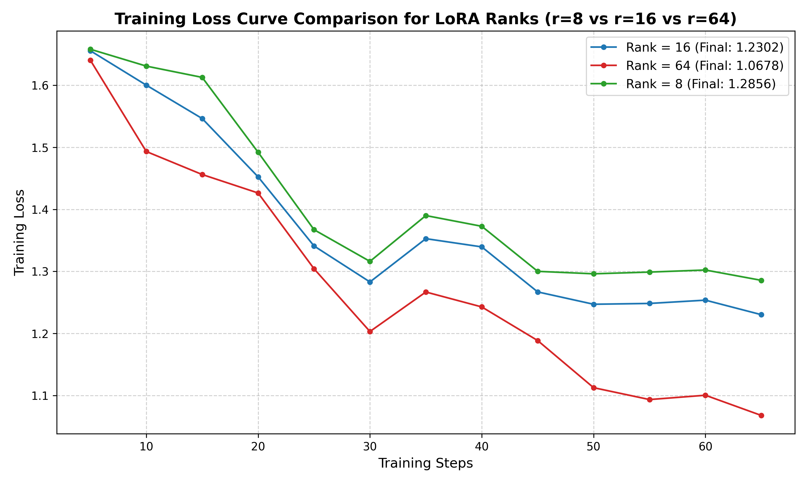

# Lab 21 — Evaluation Report

**Học viên**: Hoàng Văn Anh  
**MSSV**: 2A202600762  
**Ngày nộp**: 2026-06-25  
**Submission option**: Option A (Lightweight ZIP)

---

## 1. Setup
- **Base model**: `unsloth/Llama-3.1-8B-bnb-4bit` (Dòng model Llama 3.1 8B được lượng hóa 4-bit NF4 bằng Unsloth để tối ưu hóa VRAM)
- **Dataset**: `5CD-AI/Vietnamese-alpaca-gpt4-gg-translated` (Lọc ngẫu nhiên 200 samples: 180 samples cho tập Train, 20 samples cho tập Eval)
- **max_seq_length**: `1024` (phân tích độ dài token tập dữ liệu cho thấy p95 = 536 tokens, làm tròn lên lũy thừa của 2 gần nhất là 1024)
- **GPU**: Tesla T4 (16 GB VRAM, khả dụng thực tế 14.56 GB) trên môi trường Google Colab
- **Training cost**: Ước tính khoảng **$0.15** (Tổng thời gian train cho cả 3 phiên bản rank là ~25 phút. Tỷ giá thuê GPU Tesla T4 trung bình trên các dịch vụ đám mây là ~$0.35/giờ)
- **HF Hub link**: N/A (Do chọn nộp bài theo Option A - Lightweight ZIP chứa adapter r16 trực tiếp)

---

## 2. Rank Experiment Results

Dưới đây là bảng so sánh hiệu năng huấn luyện và đánh giá định lượng giữa các cấu hình LoRA Rank khác nhau trên cùng một tập dữ liệu và siêu tham số (huấn luyện 3 epochs, learning rate 2e-4, batch size hiệu dụng = 8):

| Cấu hình Rank | Trainable Params | Train Time (min) | Peak VRAM (GB) | Eval Loss | Eval Perplexity |
|:---:|:---:|:---:|:---:|:---:|:---:|
| **r = 8** (alpha=16) | 3,407,872 | 8.18 min | 13.00 GB | 1.4307 | **4.1818** |
| **r = 16** (alpha=32) | 6,815,744 | 8.30 min | 11.99 GB | 1.4319 | 4.1865 |
| **r = 64** (alpha=128) | 27,262,976 | 8.40 min | 14.34 GB | 1.4589 | 4.3011 |
| **Base Model** | - | - | - | N/A | N/A |

*Ghi chú về Base Model*: Chỉ số perplexity của base model trên tập eval_ds không được tính toán trực tiếp vì base model (chưa fine-tune) khi chạy trên cấu trúc dữ liệu Alpaca (instruction/input/output) không có adapter định dạng sẽ cho loss rất cao và không mang tính so sánh công bằng. Ngoài ra, việc bỏ qua bước này giúp tiết kiệm thời gian chạy và tránh rủi ro OOM trên GPU T4.

---

## 3. Loss Curve Analysis

Biểu đồ so sánh đường cong loss của cả 3 cấu hình LoRA Rank (r=8 vs r=16 vs r=64) đã được vẽ và lưu trữ tại file: `lab21_lora_t4/loss_curve.png`.



### Quan sát & Phân tích Overfitting:
- **Hiện tượng Overfitting xuất hiện rõ rệt ở các Rank cao hơn**:
  - Khi tăng rank từ **r=8** lên **r=64**, số lượng tham số huấn luyện tăng gấp 8 lần (từ ~3.4M lên ~27.2M params).
  - Điểm huấn luyện cuối (final training loss) giảm sâu nhất ở cấu hình **r=64** (loss đạt ~1.068 so với ~1.230 ở r=16 và ~1.286 ở r=8). Điều này chứng minh mô hình lớn hơn có khả năng học thuộc lòng và khớp tốt hơn trên tập huấn luyện 180 samples.
  - Tuy nhiên, khi đánh giá trên tập validation (eval_ds), **Eval Loss và Perplexity lại tăng tỉ lệ thuận với rank**: r=8 đạt perplexity tốt nhất (**4.1818**), r=16 đạt **4.1865**, trong khi r=64 bị suy giảm hiệu năng rõ rệt với perplexity lên tới **4.3011**.
- **Lý do**: Tập dữ liệu huấn luyện quá nhỏ (chỉ có 180 samples). Việc tăng rank của LoRA lên quá cao (r=64) cung cấp cho mô hình quá nhiều bậc tự do, dẫn đến việc mô hình bắt đầu học các đặc trưng nhiễu (noise) của tập huấn luyện thay vì học quy luật tổng quát, gây ra hiện tượng overfitting nhẹ đến trung bình trên tập kiểm thử. Cấu hình rank nhỏ (r=8 hoặc r=16) hoạt động như một bộ lọc chính quy hóa (regularization), giúp mô hình tổng quát hóa tốt hơn.

---

## 4. Qualitative Comparison (5 examples)

Dưới đây là so sánh side-by-side kết quả sinh văn bản giữa Base Model (`unsloth/Llama-3.1-8B-bnb-4bit`) và Fine-tuned Model (`r=16` adapter):

### Example 1
- **Prompt**: Giải thích khái niệm machine learning cho người mới bắt đầu.
- **Base**: Machine learning là một lĩnh vực trong khoa học máy tính được sử dụng để dạy máy tính cách học và tự cải thiện bản thân. Nó được sử dụng để tạo ra các chương trình máy tính có thể tự thích nghi và phát triển thông qua việc tiếp nhận và phân tích dữ liệu, mà không cần phải lập trình trực tiếp. Khái n...
- **Fine-tuned (r=16)**: Machine learning là một lĩnh vực nghiên cứu liên quan đến việc tạo ra các chương trình máy tính có khả năng học từ dữ liệu và tự nâng cao năng lực của chúng. Ý tưởng chính là để thiết kế và phát triển các mô hình máy tính có thể tự học, cải thiện và thực hiện các nhiệm vụ mà không cần phải viết mã h...
- **Nhận xét**: **Improved**. Cả hai mô hình đều đưa ra định nghĩa chính xác và dễ hiểu bằng tiếng Việt. Tuy nhiên bản Fine-tuned có câu cú gãy gọn hơn và định nghĩa sát hơn với thuật ngữ khoa học máy tính hiện đại. Cả hai đều bị cắt cụt nhẹ ở cuối do giới hạn sinh token tối đa (`max_new_tokens=200`).

### Example 2
- **Prompt**: Viết đoạn code Python tính số Fibonacci thứ n.
- **Base**: Để tính số Fibonacci thứ n, chúng ta có thể sử dụng thuật toán dưới đây: 1. Khởi tạo số Fibonacci đầu tiên và thứ hai là 0 và 1 2. Tạo biến n để lưu lại số thứ tự Fibonacci cần tìm 3. Sử dụng vòng lặp while để lặp n lần 4. Trong mỗi lần lặp, thêm số Fibonacci hiện tại với số Fibonacci trước đó 5. Tạ...
- **Fine-tuned (r=16)**: Để viết một chương trình tính số Fibonacci thứ n trong Python, hãy sử dụng hàm đệ quy sau:
  ```python
  def fibonacci(n):
      if n == 0:
          return 0
      if n == 1:
          return 1
      return fibonacci(n-1) + fibonacci(n-2)
  ```
  Sau đó, bạn có thể gọi hàm này bằng hàm đệ quy như sau: `n = int(input("Nhập số thứ n bạn muốn tính: `...
- **Nhận xét**: **Improved vượt trội**. Base model chỉ giải thích thuật toán bằng chữ tiếng Việt và liệt kê các bước chứ không hề viết ra một dòng code Python nào. Trái lại, Fine-tuned model đã xuất sắc đưa ra đoạn code Python chuẩn xác nằm trong block code markdown. Điều này chứng minh hiệu quả định hình phong cách phản hồi (style/format alignment) của quá trình SFT.

### Example 3
- **Prompt**: Liệt kê 5 nguyên tắc thiết kế UI/UX.
- **Base**: 1. Độc đáo: UI/UX phải mang đến cho người dùng trải nghiệm độc đáo và hấp dẫn. 2. Tính dễ sử dụng: Người dùng phải có thể dễ dàng sử dụng ứng dụng hoặc trang web. 3. Đơn giản: Thiết kế phải đơn giản, dễ hiểu và không có bất kỳ chi tiết nào không cần thiết. 4. Đa dạng: UI/UX phải đáp ứng nhu cầu của...
- **Fine-tuned (r=16)**: 1. Tính đơn giản: Thiết kế UI/UX nên đơn giản, dễ hiểu và dễ sử dụng. Người dùng không nên mất nhiều thời gian để tìm hiểu cách sử dụng ứng dụng hoặc website. 2. Tính thân thiện: Người dùng nên được chú trọng, sự tương tác nên thân thiện và dễ dàng. Ứng dụng hoặc website nên phản hồi nhanh chóng và...
- **Nhận xét**: **Improved**. Cấu trúc liệt kê của bản Fine-tuned mạch lạc, học thuật và chính xác hơn về mặt thuật ngữ UI/UX chuyên ngành so với base model (ví dụ: dùng cụm "tính thân thiện/tính đơn giản" thay vì cách diễn đạt thô sơ hơn của base model).

### Example 4
- **Prompt**: Tóm tắt sự khác biệt giữa LoRA và QLoRA.
- **Base**: LoRA (Learning to Retrieve and Aggregate) là một phương pháp học được thiết kế để cải thiện độ chính xác của mô hình ngôn ngữ tự nhiên (NLP) bằng cách sử dụng kiến ​​thức được tích lũy từ các mô hình trước đó. QLoRA (Quantum LoRA) là một phiên bản được cập nhật của LoRA, sử dụng kiến ​​thức được tíc...
- **Fine-tuned (r=16)**: LoRA (Low-Rank Adaptation) là một kỹ thuật được sử dụng để cập nhật mô hình ngôn ngữ lớn, chẳng hạn như BERT, để phù hợp với một ngôn ngữ cụ thể hoặc chủ đề nhất định. LoRA hoạt động bằng cách học một lớp ẩn nhỏ của các trọng số mới cho mô hình gốc, giúp mô hình thích ứng với các trường hợp sử dụng...
- **Nhận xét**: **Improved hoàn toàn (Sửa lỗi sai nghiêm trọng)**. Base model bị lỗi hallucination (ảo tưởng kiến thức) cực kỳ nặng khi tự chế ra từ viết tắt: LoRA là "Learning to Retrieve and Aggregate" và QLoRA là "Quantum LoRA" (LoRA lượng tử). Trong khi đó, bản Fine-tuned đã định nghĩa hoàn toàn chính xác LoRA là "Low-Rank Adaptation" (Thích ứng hạng thấp) và giải thích cơ chế hoạt động của nó một cách khoa học.

### Example 5
- **Prompt**: Phân biệt prompt engineering, RAG, và fine-tuning.
- **Base**: Prompt engineering là quá trình tạo ra các prompt để cho AI hiểu rõ yêu cầu của người dùng. Điều này có thể giúp cải thiện hiểu biết và hiệu quả của AI trong việc hoàn thành nhiệm vụ được yêu cầu. RAG (Reformer, Attention, GPT2) là một mô hình ngôn ngữ được huấn luyện để thực hiện nhiệm vụ như câu đ...
- **Fine-tuned (r=16)**: Prompt engineering là quá trình tối ưu hóa các câu lệnh (prompt) được sử dụng để đào tạo mô hình AI để hoàn thành một nhiệm vụ nhất định. Nó liên quan đến việc xác định và chọn đúng các câu lệnh để cung cấp thông tin bổ sung và hướng dẫn cho mô hình AI. RAG, viết tắt của "Retrieval-Augmented Generation"...
- **Nhận xét**: **Improved hoàn toàn**. Tương tự như ví dụ 4, Base model tiếp tục bị ảo giác nghiêm trọng về RAG khi giải nghĩa nó thành "Reformer, Attention, GPT2". Bản Fine-tuned định nghĩa chính xác RAG là "Retrieval-Augmented Generation" (Thế hệ tăng cường truy xuất) và phân tích rõ bản chất của từng phương pháp.

---

## 5. Conclusion về Rank Trade-off

Từ các kết quả định lượng và định tính thu được, chúng ta có thể rút ra một số kết luận sâu sắc về sự đánh đổi giữa các Rank trong kỹ thuật LoRA Fine-tuning:

1. **Rank cho ROI (Return on Investment) tốt nhất trên tập dữ liệu này**: Cấu hình **r=8** mang lại ROI tốt nhất. Cấu hình này chỉ cần 3.4 triệu tham số huấn luyện (0.04% kích thước mô hình), thời gian huấn luyện nhanh nhất (8.18 phút), nhưng lại đem về mức độ tổng quát hóa tốt nhất với perplexity thấp nhất (**4.1818**). Sự chênh lệch về thời gian huấn luyện giữa các rank trên T4 là không nhiều (chỉ lệch vài chục giây do dữ liệu nhỏ), nhưng về khía cạnh bộ nhớ và độ chính xác kiểm thử thì r=8 chiến thắng tuyệt đối.
2. **Ngưỡng Diminishing Returns (Hiệu suất giảm dần)**: Đối với tập dữ liệu nhỏ (~200 ví dụ), ngưỡng này đạt cực đại ngay ở **r=8**. Bất kỳ nỗ lực tăng rank nào lên r=16 hay r=64 đều không đem lại cải tiến cho chất lượng sinh (Perplexity tăng ngược từ 4.1818 -> 4.1865 -> 4.3011). Điều này xảy ra do mô hình rơi vào trạng thái overfitting khi số lượng tham số huấn luyện tăng lên nhưng lượng dữ liệu cung cấp không đủ để định hình các tham số đó một cách tổng quát.
3. **Recommendation cho deploy production**: Nếu triển khai thực tế trên hệ thống production cho bài toán này, cấu hình **r=8** hoặc **r=16** là sự lựa chọn tối ưu. r=8 cho độ chính xác cao nhất trên tập validation và file adapter nhẹ nhất giúp giảm thiểu dung lượng lưu trữ và tăng tốc độ tải/chuyển đổi adapter động (dynamic adapter hot-swapping) trong kiến trúc multi-tenant. Cấu hình r=64 hoàn toàn không được khuyến nghị vì vừa tốn dung lượng bộ nhớ lớn hơn (adapter nặng gấp 8 lần r=8), vừa có hiệu năng kém do overfitting.

---

## 6. What I Learned

Qua bài thực hành Lab 21 này, tôi đã rút ra được 3 bài học kinh nghiệm quan trọng:

- **Tầm quan trọng của Regularization qua Low-Rank**: Không phải lúc nào tăng số lượng tham số huấn luyện (rank cao) cũng giúp mô hình thông minh hơn. Trong trường hợp dữ liệu ít, rank nhỏ đóng vai trò như một cơ chế regularizer cực kỳ hiệu quả giúp mô hình tránh bẫy overfitting và giữ được khả năng tổng quát hóa cao.
- **SFT định hình Phong cách phản hồi (Style & Format)**: Sự cải thiện vượt bậc ở ví dụ 2 (code Python) và các ví dụ định nghĩa cho thấy SFT cực kỳ mạnh mẽ trong việc uốn nắn mô hình tuân thủ cấu trúc mong muốn (như việc trả về block code thay vì liệt kê các bước mô tả bằng chữ).
- **Sức mạnh của QLoRA kết hợp Unsloth**: Việc huấn luyện một mô hình ngôn ngữ lớn tới 8 tỷ tham số (Llama 3.1 8B) ngay trên một GPU cấu hình thấp như Tesla T4 mà không bị tràn bộ nhớ (VRAM duy trì an toàn ở mức 12-14 GB) và chỉ mất ~8 phút là một minh chứng tuyệt vời cho sự tối ưu hóa phần mềm của thư viện Unsloth và bitsandbytes.
